# README

1. [About](README.md#L31)

    1. [Marketing Cloud App Center](README.md#L55)

    2. [Push Notifications](README.md#L75)

    3. [Subscriber key](README.md#L79)

    4. [Tags](README.md#L89)

    5. [Beacon and Geofence Messages](README.md#L93)

2. [Android](README.md#L103)

    1. [Previous steps](README.md#L105)

        1. [Provision Apps with Google](README.md#L111)

        2. [Create your apps in the App Center](README.md#L177)

            1. [Add app to App Center](README.md#L187)

            2. [Integrate App Center app](README.md#L213)

    2. [Implementing the SDK Push Notifications](README.md#L249)

    3. [Subscriber Key Implementation](README.md#L362)

    4. [Tag Implementation](README.md#L403)

    5. [Beacon and Geofence Message Implementation](README.md#L429)

3. [iOS](README.md#L467)

    1. [Previous steps](README.md#L469)

        1. [iOS Provisioning Panel](README.md#L475)

        2. [Create your apps in the App Center](README.md#L585)

            1. [Add app to App Center](README.md#L595)

            2. [Integrate App Center app](README.md#L621)

    2. [Implementing the SDK Push Notifications](README.md#L657)

    3. [Subscriber Key Implementation](README.md#L705)

    4. [Tag Implementation](README.md#L719)

    5. [Beacon and Geofence Message Implementation](README.md#L738)

# About

This project provides a template for creating a mobile app (Android or iOS) that uses the Journey Builder for Apps SDK.  It is also a UI for exploring its features and provides a mechanism to collect and send debugging information to learn about the workings of the SDK as you explore.

The code in this repository includes all of the code used to run the fully functional APK. However, the API keys have been removed. To debug, modify or create a new app the following keys must be set within the corresponding file.

For Android (`secrets.xml`):

1. `app_id`: the App ID for your development app as defined in the App Center section of the Marketing Cloud.

2. `gcm_sender_id`: the Google Cloud Messaging ID as defined in the Google Cloud Developers Console for your app.

3. `access_token`: the Access Token for your development app as defined in the App Center section of the Marketing Cloud.

NB: You can use different keys for the staging/testing phase and the production phase.  Staging/testing keys are indicated by the prefix `staging_`.

For iOS (`AppDelegate+ETPushConstants.m`):

1. `kETAppID_Prod`: the App ID for your development app as defined in the App Center section of the Marketing Cloud.

2. `kETAccessToken_Prod`: the Access Token for your development app as defined in the App Center section of the Marketing Cloud.

NB: You can use different keys for the staging/testing phase and the production phase.  Staging/testing keys are called `kETAppID_Debug` and `kETAccessToken_Debug`.

## Marketing Cloud App Center

App Center is the central development console for using Fuel’s APIs and building Marketing Cloud apps.

In order to connect your app to the Marketing Cloud, you must first create a MobilePush app in the App Center. 

Each app in App Center represents an application connected to the Marketing Cloud. App Center currently manages four types of connected apps:

* *API Integration* allows you to leverage the Marketing Cloud APIs. Create an API Integration app when you want to use Fuel APIs to automate tasks or integrate business systems. API Integration apps utilize an OAuth2 client credentials flow to acquire access tokens directly from the Fuel authentication service.

* *Marketing Cloud apps* represent apps that live within the Salesforce Marketing Cloud and launch via the Marketing Cloud app menu. Marketing Cloud apps include custom apps built by your organization or apps installed from the Salesforce Marketing Cloud HubExchange. Marketing Cloud apps utilize a JSON Web Token (JWT) to acquire access tokens on behalf of logged in users.

* *Application Extensions* allow you to extend the Marketing Cloud with custom Journey Builder activities, Cloud Editor Blocks, and Automation Studio activities.

* *MobilePush apps* represent apps built for the iOS, Android, or Blackberry mobile platforms that use MobilePush to communicate with their users via push messages. The Salesforce Marketing Cloud classifies MobilePush apps as consumer-grade applications and utilize long-lived limited access tokens.

If you haven’t already, you should [create an App Center account](https://appcenter-auth.exacttargetapps.com/create).

If you have an App Center account, you can [log in to that account](https://appcenter-auth.exacttargetapps.com/redirect).

## Push Notifications

MobilePush lets you create and send targeted push messages based on cross-channel consumer data to encourage app usage and deliver increased ROI.  With MobilePush, you view how users navigate through your app and because MobilePush is built on the Salesforce Marketing Cloud, you can easily integrate push message campaigns with any email, SMS, or social campaigns.

## Subscriber key

A subscriber is a person who has opted to receive communications from your organization. 

A valid email address is required to receive emails and a phone number to receive SMS messages.  Additional information about subscribers can be tracked using profile and preference attributes.

The Subscriber Key serves to identify your subscribers.

It can be set to a specific value provided by the subscriber such as a phone number, email address, or other appropriate value but most importantly a value that you choose.

For example, using a subscriber key to identify a subscriber with a value other than the email address would allow you to:

* Maintain multiple sets of subscriber attributes for a single email address. For example, if a family shares an email address, you can use a subscriber key to uniquely identify each member of the family.

* Include a single email address multiple times on a list. For example, if a message interaction sends a separate message for each car a subscriber owns, it may be appropriate for a single subscriber to receive multiple messages.

The Salesforce Marketing Cloud interface as well as the Web Service SOAP API support functionality around subscribers identified with a subscriber key.

## Tags

Tags let you implement contact segmentation. You can set tags for subscriptions as defined by user choice.  Additionally, use tags to collect information from the mobile app and for unstructured data or data that can contain many potential unknown values. For example, you can use tags when the number of potential attribute names exceeds the number of potential values of an individual attribute (such as the favorite brand specified by a contact).

## Beacon and Geofence Messages

You can use the location capabilities of the *JB4A SDK* to target messages to a segmented group of contacts. The app pre-downloads geofence messages and triggers those messages when a mobile device crosses a geofence boundary.  To use this functionality:

1. The account must have access to both MobilePush and Location Services.

2. Ensure that you use version 7.8.0 or earlier of Google Play Services to enable geolocation for your app.

3. You must receive user permission to implement location services.

# Android

## Previous steps

1. Provision Apps with Google  

2. Create your apps in the App Center

### Provision Apps with Google

These steps are key to receiving push messages in your app.

Review the Android documentation regarding the integration of your Android mobile app with Google Cloud Messaging found in [Google Cloud Messaging (GCM) HTTP connection server.](https://developer.android.com/google/gcm/http.html)

1. Log into the [Google Developers Console](https://console.developers.google.com/) and click **Create a project...**.

    1. Enter a name for your project in the **PROJECT NAME** field.

    2. Use the suggested default ID for your project or click in **Edit** to enter a custom one.

    3. Click Create.

2. Record the Project Number value supplied by the Google Cloud Console. You will use this value later in your Android application code as the **Google Cloud Messaging Sender ID**.

    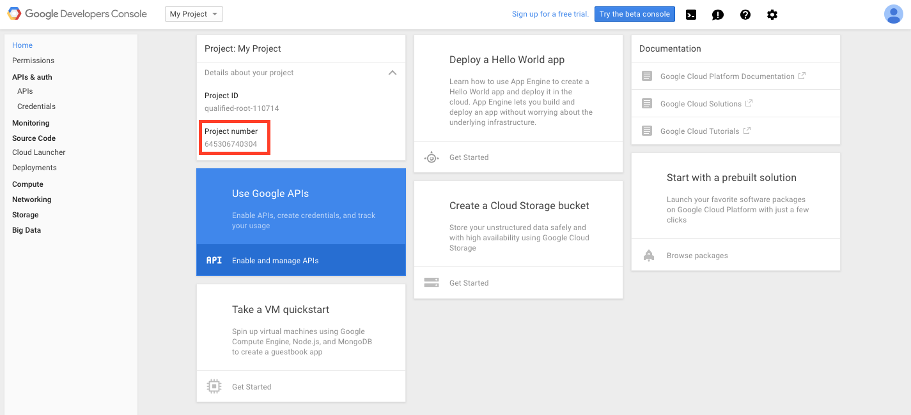

3. In the the left menu click on **APIs** (**APIs & auth** section).

4. Enable **Google Cloud Messaging for Android** by clicking Google Cloud Messaging For Android:

    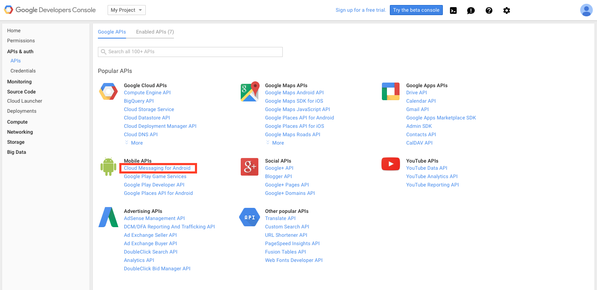

5. Click the button that says "Enable API".

    

6. Click **Credentials** in the left menu.

7. Click **Add credentials **→ **API key**, and select **Android key** in the dialog.

    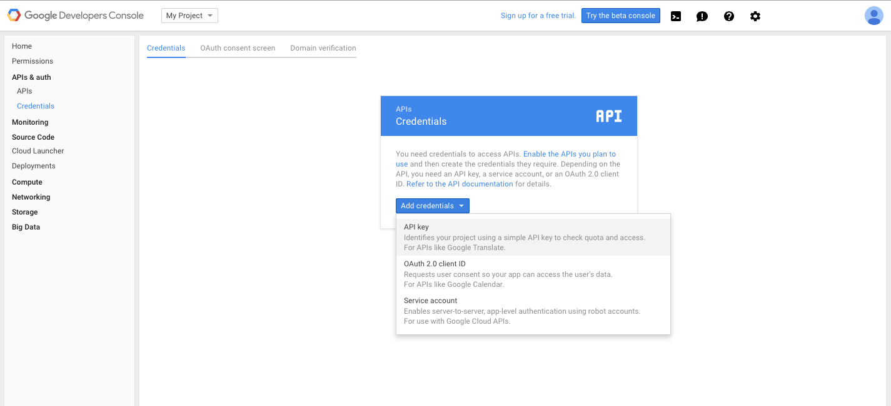

    

8. Retrieve the **SHA1 Certificate Fingerprint** of the Android Debug Key from a (Unix/Mac) Terminal or (Windows) Command Prompt.  *Have each developer on your team complete this step and provide their SHA1 Certificate Fingerprint for inclusion in the ***_allowed Android applications_*** field below. ***_You will also need to add an entry for your production signing key._**

    Unix/Mac: `keytool -exportcert -alias androiddebugkey -keystore ~/.android/debug.keystore -list -v`

    Windows: `keytool -alias androiddebugkey -keystore %USERPROFILE%\.android\debug.keystore -list -v`

    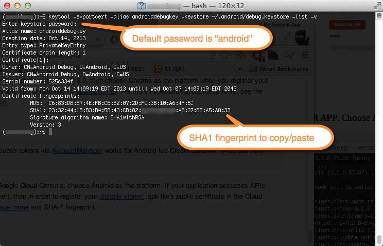

    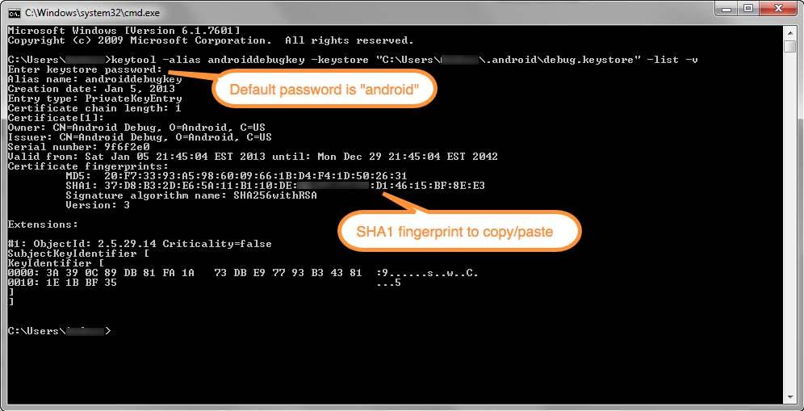 

9. Enter a name for your key, and click in **Add package name and fingerprint**. Enter your package name (must match the package name you will use in your Android project) and paste each developer’s **SHA1 Certificate Fingerprint** separated by a semicolon in the corresponding fields, and then click **Create**.

    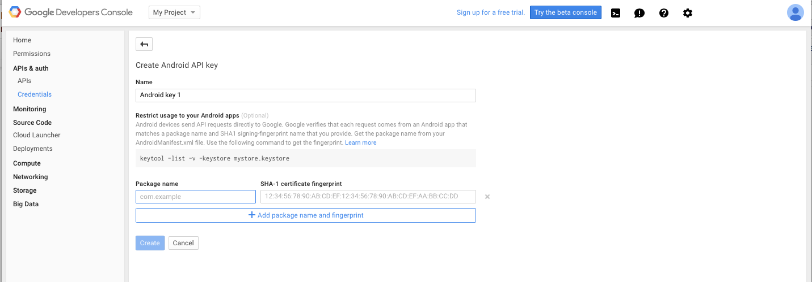

10. Click **Ok** in the dialog.

    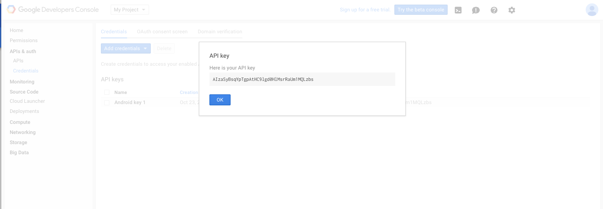

11. Now create a new Server key by repeating step 7 but choosing **Server key**.

12. Enter a name for the key. You can enter server IP address to filter request or leave this entry blank.

    *Important: Leaving this entry blank will simplify development but is not secure. When you have verified that you have things setup correctly you should restrict access by providing individual server IP addresses or, at least, restrict the range to your known address ranges.*

    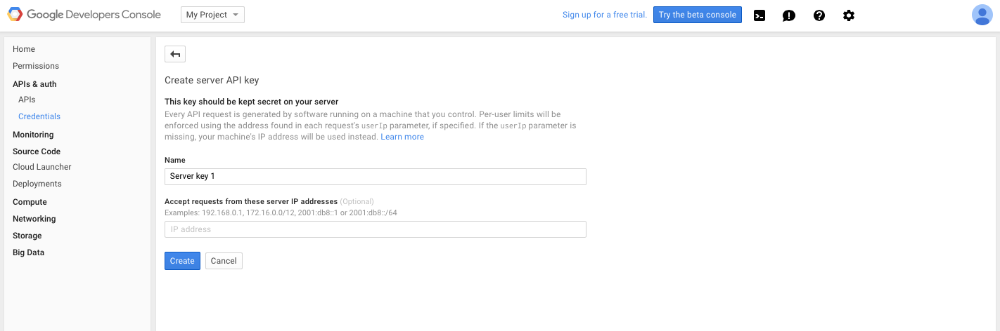

13. Click **Create** and copy the **API KEY** value from the **Server application**.

14. Use the API Key from the server application created above to add to your MobilePush app in the *Create your apps in the App Center* step. And use the project number to set the `gcm_sender_id` in your project.

### Create your apps in the App Center

In order to connect your app to your Marketing Cloud account, you must follow these steps:

1. Add app to App Center.

2. Integrate the App Center app to your Marketing Cloud account.

3. Add the Provisioning info created in the GCM Console to the app in the App Center.

#### Add app to App Center

To create a new MobilePush app:

1. [Log in to the App Center](https://appcenter-auth.exacttargetapps.com/redirect) ([create an account](https://appcenter-auth.exacttargetapps.com/create) if necessary).

2. Create a new app and select the MobilePush template.

    

3. Fill in, at a minimum, the mandatory fields in this form.

    

    *Depending on your setup, repeat this process if you plan on using different instances for production and development.*

    Note the following about the required fields:

      1. The **Name** can be anything you choose.

      2. The **Package** has no correlation to anything outside of the MarketingCloud ecosystem and can be **any** unique identifier for your application.

      3. The **Description** & **MobilePush Icon** fields are optional but will help you identify your application within your Marketing Cloud account. 

4. Click **Next** in order to integrate this new app with your Marketing Cloud account.

#### Integrate App Center app

The MobilePush app created in the App Center must be connected to a specific Marketing Cloud account. You must have a login for your Marketing Cloud account in order to connect this MobilePush app to the correct Marketing Cloud account.

Follow these steps in order to connect this MobilePush app to the correct Marketing Cloud account:

1. Select an account (or New…) in the **Account** drop-down.

    

2. Select the **Production ExactTarget Account** button *unless otherwise instructed by your Salesforce Marketing Cloud relationship manager.*

3. Click **Link to Account**.

    A popup window (pictured below) will appear.

    

4. In an Enterprise 2.0 account, ensure that you select the correct business unit for your app integration.

5. Click **Integrate**.

6. In the GCM Client section, enter the server API KEY previously created in the [Provision Apps with Google](#heading=h.1aedy6lcafpy) step (you can get this key by entering in the [Google Cloud Console](https://console.developers.google.com/)).

    

7. When you have all the fields required for your application’s platform(s) populated, click *Next*.

8. Review the information you provided and check for any potential errors and click **Finish**.

    You should be presented with a *Success!* message and an application details screen. Any of the areas can be edited by clicking the edit icon associated with the **Summary** or **Application Provisioning** sections.

    

Record the **Application ID** and the **Access Token** as they will be used later in the secrets.xml file.

## Implementing the SDK Push Notifications

Update the following files in your project:

1. secrets.xml
2. AndroidManifest.xml
3. build.gradle
4. app/build.gradle
5. ApplicationClass.java

**Secrets.xml**

The SDK can now be configured with the App ID and Access Token, as explained in the *About* section.  Update `app_id` and `access_token` with their respective values.

**AndroidManifest.xml**

In this file declare the following permissions:

*JB4A SDK Google Permissions*

These permissions are required to receive push messages which use the Google Cloud Messaging service.
```java
<!-- JB4A SDK Google Permissions -->
<permission 
    android:name="${applicationId}.permission.C2D_MESSAGE"
    android:protectionLevel="signature" />
<uses-permission android:name="${applicationId}.permission.C2D_MESSAGE" />
<uses-permission android:name="com.google.android.c2dm.permission.RECEIVE" />
<!-- END JB4A SDK Google Permissions -->
```
*JB4A SDK required permissions*

These permissions are necessary for the SDK to function.  The first three permissions establish internet connection status for the application to synchronize with Marketing Cloud. The WAKE_LOCK permission allows PowerManager WakeLocks to keep the processor from sleeping or screen from dimming.
```java
<!-- JB4A SDK required permissions -->
<uses-permission android:name="android.permission.INTERNET" />
<uses-permission android:name="android.permission.ACCESS_NETWORK_STATE" />
<uses-permission android:name="android.permission.ACCESS_WIFI_STATE" />
<uses-permission android:name="android.permission.WAKE_LOCK" />
<!-- END JB4A SDK required permissions -->
```
In the activity section, make sure to include the ETPushReceiver and Service for the push notifications.
```java
<!-- ETPushReceiver and Service -->
<receiver
    android:name="com.exacttarget.etpushsdk.ETPushReceiver"
    android:permission="com.google.android.c2dm.permission.SEND" >

   <intent-filter>
       <action android:name="${applicationId}.MESSAGE_OPENED" />
       <action android:name="com.exacttarget.etpushsdk.SEND_REGISTRATION" />
       <action android:name="com.google.android.c2dm.intent.RECEIVE" />
       <action android:name="com.google.android.c2dm.intent.REGISTRATION" />
       <action android:name="android.intent.action.ACTION_SHUTDOWN" />
       <action android:name="android.intent.action.AIRPLANE_MODE" />
       <action android:name="android.intent.action.BATTERY_LOW" />
       <action android:name="android.intent.action.BATTERY_OKAY" />
       <action android:name="android.intent.action.BOOT_COMPLETED" />
       <action android:name="android.net.conn.CONNECTIVITY_CHANGE" />
       <category android:name="${applicationId}" />
   </intent-filter>

   <intent-filter>
       <action android:name="android.intent.action.PACKAGE_REPLACED" />
       <data android:scheme="package" />
   </intent-filter>
</receiver>

<service
    android:name="com.exacttarget.etpushsdk.ETPushService"
    android:enabled="true" />

<!-- END ETPushReceiver and Service -->
```
**build.gradle**

Add the following repository:
```java
allprojects {
  …
  repositories {
    jcenter()
      mavenCentral()
        maven {url "http://salesforcefuel.github.io/JB4A-SDK-Android/repository"
      }
      …
   }
   …
}
```
**app/build.gradle**

Include the following dependencies in your application's app/build.gradle file:
```java
dependencies {
   /* SDK */
   compile 'com.exacttarget.etpushsdk:etsdk:4.0.6@aar'
   /* Google Play Services for GCM and Location */
   compile 'com.google.android.gms:play-services-location:7.8.0'
   compile 'com.google.android.gms:play-services-gcm:7.8.0'
   /* Google's Support v4 for Notification compatibility */
   compile 'com.android.support:support-v4:21.0.2'
   /* 3rd Party Libraries Required for SDK integration */
   compile 'com.android.support:appcompat-v7:23.1.0'
   compile 'com.android.support:support-v4:23.1.0'
   compile 'com.android.support:design:23.1.0'
}
```

**ApplicationClass.java**

The boolean parameters `ANALYTICS_ENABLED`, `CLOUD_PAGES_ENABLED`, `WAMA_ENABLED` and `LOCATION_ENABLED` enable certain functionalities of the SDK, however, they are not required for the push notifications themselves to function which will still be sent even if all are set to false.

## Subscriber Key Implementation

1. Create a new activity called `SettingsActivity` that extends `PreferenceActivity` in your project.

2. Create a new fragment called `SettingsFragment` that extends `PreferenceFragment`.

3. Now create an instance of the SettingsFragment in the SettingsActivity class, add the following code to the `onCreate()` method:
    ```java
    getFragmentManager().beginTransaction().replace(android.R.id.content, new SettingsFragment()).commit();
    ```
4. Create a new file called preferences.xml in res/xml that will be the settings view.

5. Reference the preferences.xml file in the `onCreate()` method in the SettingsFragment class with the following code: `addPreferencesFromResource(R.xml.preferences);`

6. Add a private attribute SharedPreferences sp and set it as the default shared preference:
    ```java
    private SharedPreferences sp;
    …
    this.sp = getActivity().getPreferences(Context.MODE_PRIVATE);
    ```

7. Add a private attribute pusher, the instance of ETPush:
    ```java
    private ETPush pusher;
    …
    this.pusher = ETPush.getInstance();
    ```
8. Now create the reference to the EditTextPreference from preferences.xml and set the value stored in settings Preferences. Add an `OnPreferenceClickListener()` to open a Dialog with input for the user to enter their Subscriber Key.  This value is stored in the settings Preferences and will be passed to the pusher.

    ```java
    SharedPreferences.Editor editor = sp.edit();
    editor.putString(KEY_PREF_SUBSCRIBER_KEY, newSubscriberKey);
    editor.commit();
    …
    pusher.setSubscriberKey(newSubscriberKey);
    ```

It will take up to 15 minutes for the new value to be recorded in the Contact Record. If an internet connection is not available when the update is made, the SDK will save the update and send it whenever the network becomes available.

By default, if your app does not set the Subscriber Key using `setSubscriberKey()`, the registration sent will be matched with a Contact Record that matches the System Token included in the registration payload. If no match is found, then a new Subscriber Key will be set in the Marketing Cloud and will not be sent back to the SDK.

## Tag Implementation

This feature is implemented in Settings Preferences.  We assume that the Subscriber Key feature has been implemented as described in this guide in order for the following steps to work.

1. Add a Set of tags as a private attribute.

   `private Set<String> allTags;`

2. For the implementation of this feature, an instance of PreferenceScreen is needed to display the tags dynamically on the screen.
   
   `private PreferenceScreen prefScreen;`

3. In the onCreate() method set the values for prefScreen.

   `this.prefScreen = getPreferenceScreen();`

4. To display the tags on screen, call these methods inside the onCreate() method:
    ```java
    storeAllTags(this.pusher.getTags());
    configureTags();
    ````

The `storeAllTags(Set<String> tags)` method saves the tags in Preferences and populates the allTags attribute with all of the stored tags.

The `configureTags()` method renders the tags section, a clickable EditTextPreference to add a new tag and the tags from allTags with checkboxes to enable/disable the tag.

## Beacon and Geofence Message Implementation

1. In your application’s app\build.gradle file add the following dependence (required for applications that will run on devices with Android OS < 5.0):
    
    ```java
    dependencies{
        /* 3rd Party Libraries Required for SDK integration */
        compile 'com.radiusnetworks:AndroidIBeaconLibrary:0.7.6'
    }
    ```
2. In your AndroidManifest, add the *JB4A SDK Permissions for location and region monitoring*, and the ETLocation Receiver and Service required to receive the push notifications based on the location of the customer.

    ```java
    <!-- JB4A SDK Permissions for location and region monitoring -->
    <uses-permission android:name="android.permission.ACCESS_COARSE_LOCATION" />
    <uses-permission android:name="android.permission.ACCESS_FINE_LOCATION" />
    <uses-permission android:name="android.permission.RECEIVE_BOOT_COMPLETED" />
    <!-- END JB4A SDK location and region monitoring Permissions -->
    …

    <!-- ETLocationReceiver and Service -->
    <receiver android:name="com.exacttarget.etpushsdk.ETLocationReceiver" >
        <intent-filter>
            <action android:name="android.location.PROVIDERS_CHANGED" />
            <category android:name="android.intent.category.DEFAULT" />
        </intent-filter>
    </receiver>

    <service
        android:name="com.exacttarget.etpushsdk.ETLocationService"
        android:enabled="true" />
    <!-- END ETLocationReceiver and Service -->
    ```
3. In your ApplicationClass, set the `LOCATION_ENABLED` parameter to true:

    `public static final boolean LOCATION_ENABLED = true;`


# iOS

## Previous steps

1. [iOS Provisioning Panel](#heading=h.n7uu76rehwgi)

2. [Create your apps in the App Center](#heading=h.93541hvmgam9)

### iOS Provisioning Panel

You must provision your mobile app in the iOS Provisioning Panel. The certificates issued in the process remain valid for one year. Ensure that you repeat this procedure once per year before your certificates expire to maintain app functionality. Follow the instructions below to integrate version 3.4.2 of the Journey Builder for Apps SDK with your iOS mobile app.

1. Log in at the iOS Dev Center.

2. Click Certificates, Identifiers & Profiles.

    

3. Click Identifiers.

    

4. Click the + icon to create a new app.

    

5. Enter a name for the app in the Name text field.

    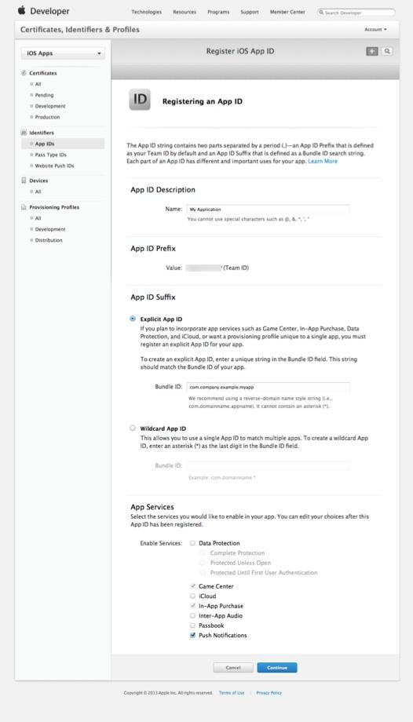

6. Enter an explicit app ID in the Bundle ID field.

7. Click the checkbox next to Push Notifications.

8. Click Continue.

9. Click Submit to confirm your app ID creation.

10. Select your app in the presented list.

    

11. Click Edit.

12. Click Create Certificate... under Development SSL Certificate or Production SSL Certificate depending on the instance of the app you provision. Note that you must repeat these steps for both the development and production instances of this app.

    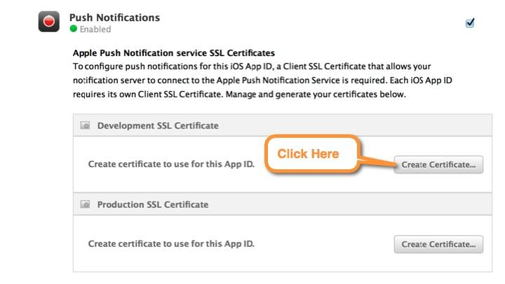

13. Launch Keychain Access on your Mac.

    

14. Click Keychain Access.

15. Click Certificate Assistant.

16. Click Request a Certificate from a Certificate Authority...

17. Enter your email address in the User Email Address field.

    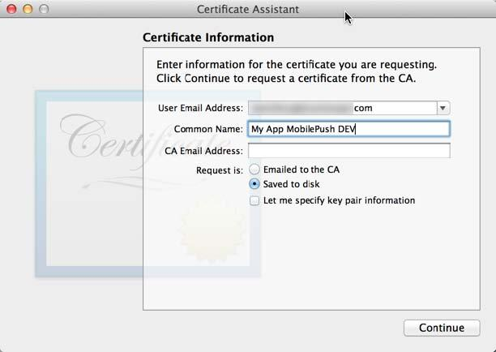

18. Enter a recognizable name for the certificate in the Common Name field.

19. Click Saved to disk.

20. Click Continue.

21. Enter a filename for the saved certificate.

    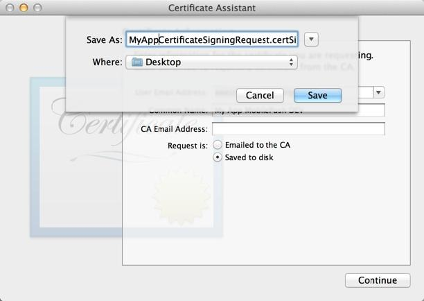

22. Choose a location at which to save the certificate.

23. Click Save.

24. Return to the iOS Dev Center website.

25. Click Continue.

    

26. Click Choose File.

27. Select the file saved in step 23.

    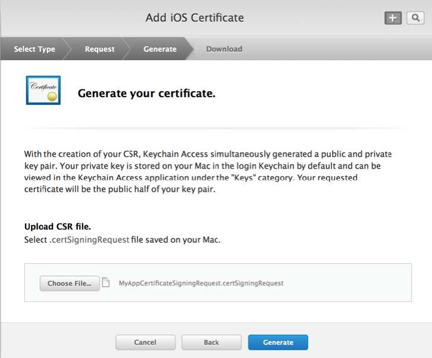

28. Click Generate.

29. Click Download.

    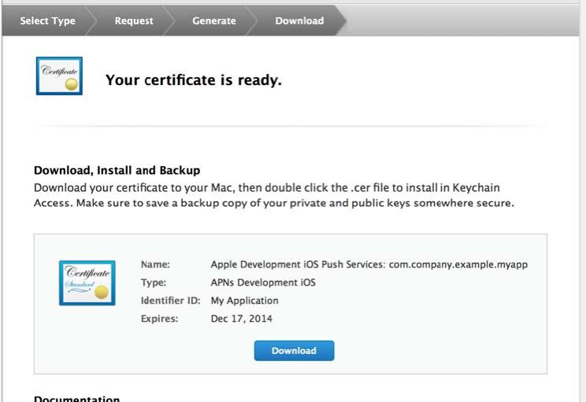

30. Double-click the downloaded file to install the certificate in Keychain Access.

31. Select the certificate in Keychain Access.

    

32. Right-click on the certificate.

33. Select Export. Ensure that you select only the certificate entry when exporting your certifications. Selecting multiple lines for export will cause an upload failure. Ensure you do not export the certificate as an embedded key.

34. Select a location to which to save the certificate.

35. Click Save.

36. Optionally, enter a password in the Password field.

    

37. If you entered a password, enter that password again in the Verify field.

38. If you entered a password, Click OK.

39. Use the production and development certificates (the .p12 files) created in the previous steps along with the passwords to add to your MobilePush app in the the *Create your apps in the App Center* step.

### Create your apps in the App Center

In order to connect your app to your Marketing Cloud account, you must follow these steps:

1. Add app to App Center.

2. Integrate the App Center app to your Marketing Cloud account.

3. Add the Provisioning info created in the iOS Dev Center to the app in the App Center.

#### Add app to App Center

To create a new MobilePush app:

1. [Log in to the App Center](https://appcenter-auth.exacttargetapps.com/redirect) ([create an account](https://appcenter-auth.exacttargetapps.com/create) if necessary).

2. Create a new app and select the MobilePush template

    

3. Fill in, at a minimum, the mandatory fields in this form.

    

    *Depending on your setup, repeat this process if you plan on using different instances for production and development.*

    Note the following about the required fields:

      1. The **Name** can be anything you choose.

      2. The **Package** has no correlation to anything outside of the MarketingCloud ecosystem and can be **any** unique identifier for your application.

      3. The **Description** & **MobilePush Icon** fields are optional but will help you identify your application within your Marketing Cloud account. 

4. Click **Next** in order to integrate this new app with your Marketing Cloud account.

#### Integrate App Center app

The MobilePush app created in the App Center must be connected to a specific Marketing Cloud account. You must have a login for your Marketing Cloud account in order to connect this MobilePush app to the correct Marketing Cloud account.

Follow these steps in order to connect this MobilePush app to the correct Marketing Cloud account:

1. Select an account (or New…) in the **Account** drop-down.

    

2. Select the **Production ExactTarget Account** button *unless otherwise instructed by your Salesforce Marketing Cloud relationship manager.*

3. Click **Link to Account**.

    A popup window (pictured below) will appear.

    

In an Enterprise 2.0 account, ensure that you select the correct business unit for your app integration.

4. Click **Integrate**.

5. In the APNS Client section, click **Choose File** and upload the APNS certificate provided when you created your app in the[ iOS Dev Center](https://developer.apple.com/devcenter/ios/).

6. Type in the APNS certificate password in the **Password** field.

    

7. When you have all the fields required for your application’s platform(s) populated, click *Next*.

8. Review the information you provided and check for any potential errors and click **Finish**.

    You should be presented with a *Success!* message and an application details screen. Any of the areas can be edited by clicking the edit icon associated with the **Summary** or **Application Provisioning** sections.

    

## Implementing the SDK Push Notifications

**AppDelegate+ETPushConstants.m**

The SDK can now be configured with the App ID and Access Token, as explained in the *About* section.  Update `kETAppID_Prod` and `kETAccessToken_Prod` with their respective values.

**AppDelegate+ETPush.m**

The boolean parameters `withAnalytics`, `andLocationServices`, `andCloudPages` and `withPIAnalytics` enable certain functionalities of the SDK, however, they are not required for the push notifications themselves to function which will still be sent even if all are set to `NO`.

```objective-c
successful = [[ETPush pushManager] configureSDKWithAppID:kETAppID_Debug         // set the Debug ID
                                          andAccessToken:kETAccessToken_Debug   // set the Debug Access Token
                                           withAnalytics:NO                     
                                     andLocationServices:NO                     // set geoLocation
                                           andCloudPages:NO                     
                                         withPIAnalytics:NO
                                                   error:&error];
```
If the configuration is successful and returns YES, the push notifications are registered.

```objective-c
UIUserNotificationSettings *settings = [UIUserNotificationSettings settingsForTypes:
                                        UIUserNotificationTypeBadge |
                                        UIUserNotificationTypeSound |
                                        UIUserNotificationTypeAlert
                                                                         categories:nil];
        
[[ETPush pushManager] registerUserNotificationSettings:settings];
[[ETPush pushManager] registerForRemoteNotifications];
…
[[ETPush pushManager] applicationLaunchedWithOptions:launchOptions];
```
If the configuration is unsuccessful an error message is shown:
```objective-c
dispatch_async(dispatch_get_main_queue(), ^{
    /**
     Something has failed in the configureSDKWithAppID call - show error message
     */
    [[[UIAlertView alloc] initWithTitle:NSLocalizedString(@"Failed configureSDKWithAppID!", @"Failed configureSDKWithAppID!")
                                message:[error localizedDescription]
                                elegate:nil
                      cancelButtonTitle:NSLocalizedString(@"OK", @"OK")
                      otherButtonTitles:nil] show];
});
```
Check the error object for detailed failure info. See file PushConstants.h for codes.

## Subscriber Key Implementation

To update the subscriber key, you should create a feature for the user to introduce a value, and then set this new value in the pushManager.

**MCSubscribeKeyViewController.m**

To get the subscriber key, use the following snippet (you can assign this value to any variable):
```objective-c
self.subscriberKey.text = [[ETPush pushManager] getSubscriberKey];
```
To set the subscriber key, use the following snippet (substitute self.subscriberKey.text with the appropriate value):
```objective-c
[[ETPush pushManager] setSubscriberKey:self.subscriberKey.text];
```
## Tag Implementation

To implement contact segmentation by tags, include code to set tags for subscriptions as defined by user choice.

**MCTagsViewController.m**

To add a tag:
```objective-c
[[ETPush pushManager] addTag:@"tag"];
```
To remove a tag:
```objective-c
[[ETPush pushManager] removeTag:@"tag"];
```
To get all the tags:
```objective-c
[[ETPush pushManager] allTags];
```

## Beacon and Geofence Message Implementation

**AppDelegate+ETPush.m**

To implement location services, pass a `YES` value for the `andLocationServices` parameter and use `ETLocationManager` to monitor location and geofence for a user.
```objective-c
successful = [[ETPush pushManager] configureSDKWithAppID:kETAppID_Debug         // set the Debug ID
                                          andAccessToken:kETAccessToken_Debug   // set the Debug Access Token
                                           withAnalytics:NO                     
                                     andLocationServices:YES                    // set geoLocation
                                           andCloudPages:NO                     
                                         withPIAnalytics:NO
                                                   error:&error];
```
Make sure you also add the "NSLocationAlwaysUsageDescription" key to your application’s *.plist file. See docs: [NSLocationAlwaysUsageDescription](https://developer.apple.com/library/ios/documentation/General/Reference/InfoPlistKeyReference/Articles/CocoaKeys.html#//apple_ref/doc/uid/TP40009251-SW18) and [NSLocationUsageDescription](https://developer.apple.com/library/ios/documentation/General/Reference/InfoPlistKeyReference/Articles/CocoaKeys.html#//apple_ref/doc/uid/TP40009251-SW27).

After push notifications are registered, start watching locations to retrieve the fence and location notifications from ET Geofences and Beacons:
```objective-c
/**   
 Start geoLocation
 */
[[ETLocationManager locationManager]startWatchingLocation];
        
/**
 Begins fence retrieval from ET of Geofences.
 */
[ETRegion retrieveGeofencesFromET];
        
/**
 Begins fence retrieval from ET of Beacons.
 */
[ETRegion retrieveProximityFromET];
```
When the application enters background mode, Location Services are disabled through the MobilePush SDK.

```objective-c
- (void)applicationDidEnterBackground:(UIApplication *)application {
    /**
     Use this method to disable Location Services through the MobilePush SDK.
     */
    [[ETLocationManager locationManager]stopWatchingLocation];
}
```
When the application becomes active, Location Services are initiated through the MobilePush SDK.
```objective-c
- (void)applicationDidBecomeActive:(UIApplication *)application {
    /**
     Use this method to initiate Location Services through the MobilePush SDK.
     */
    [[ETLocationManager locationManager]startWatchingLocation];
}
```
**MCGeoLocationViewController.m**
To check if locations are active, use the boolean method:
```objective-c
[[ETLocationManager locationManager]getWatchingLocation]
```
If locations are active it returns `YES`, otherwise it returns `NO`.

To obtain the monitored regions use this method:
```objective-c
[[ETLocationManager locationManager] monitoredRegions]
```